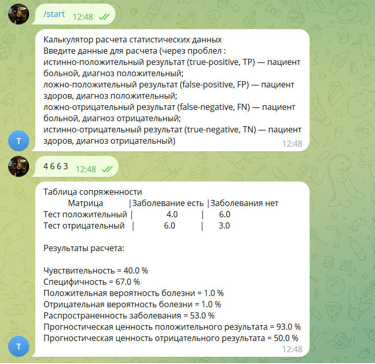

# TelegramBot (Task 16)
## В ходе выполнения задания, в практической работе был реализован:
Телеграм бот для рассчета статистических данных. Для начала работы пользователь вводит комманду /start, затем вводит данные для рассчета с клавиатуры
## Интерфейс программы
### Главное окно программы.

